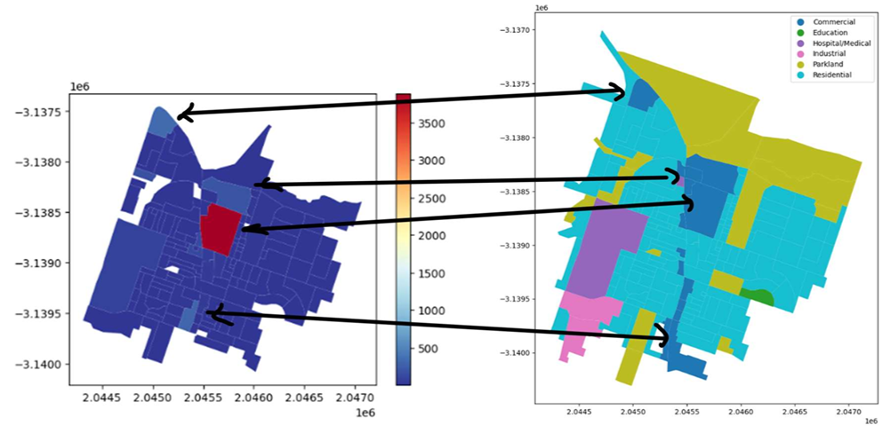
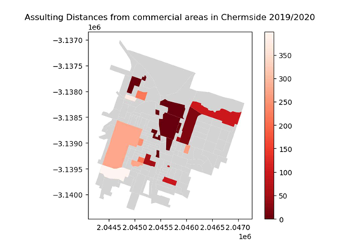
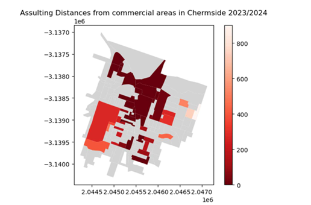

# Spatial Analysis: The Influence of Infrastructure on Crime Incidents

## Project Overview

Every crime is inherently tied to a location, whether it be a street, address, district, or postal code. 
Geographic Information Systems (GIS) have proven to be powerful tools for analysing these 
locational aspects.

This study focuses on Chermside and Capalaba, suburbs in Queensland to explore the relationship 
between infrastructure and crime incidents using spatial analysis techniques. By analysing 
offence data from Queensland Police Services, the research aims to identify the influence of 
infrastructure on crime incidents and to investigate the distance decay relationship between 
these incidents and the infrastructure in the suburbs.
## Key Insights

- Spatial analysis is an effective tool for gaining insights into location-related issues. This study 
demonstrates its use in examining the influence of infrastructure on crime incidents.

- Spatial analysis enables the visualization and interpretation of complex crime data, revealing that crime is not evenly distributed across a suburb.

- The findings highlight that infrastructure, particularly commercial areas, significantly impacts crime patterns.

- The distance decay analysis shows that most crimes occur near commercial hubs, with crime rates decreasing as the distance from key 
infrastructures increases.

- Overall, this study provides valuable insights into the relationship between infrastructure and crime incidents, offering a foundation for targeted interventions.

## Data Source
Crime data for last 5 years (2019 - 2024) used from [Queensland Police Services](https://www.data.qld.gov.au/dataset/crime-locations-2000-present) 
Relevant Geographical data (i.e. suburbs and local government area) by [ABS meshblocks](https://www.abs.gov.au/statistics/standards/australian-statistical-geography-standard-asgs-edition-3/jul2021-jun2026). 

## Tools & Technologies
- ArcGIS Online
- Python (geoandas, NumPy, Matplotlib)

- Jupyter Notebook

- Git

## Access Full Report
[Spatial Analysis: The Influence of Infrastructure on Crime Incidents](full_report.pdf)

